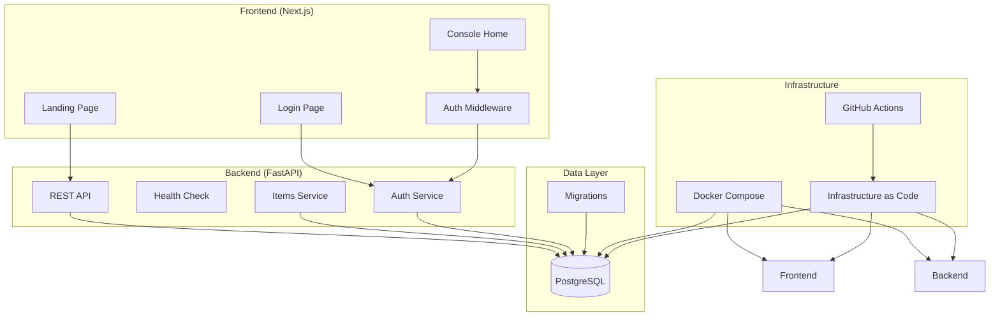

# Design Document: LINE Commerce Monorepo Template

## Overview

The LINE Commerce Monorepo Template provides a production-ready foundation for building e-commerce applications with modern web technologies. The design emphasizes simplicity, maintainability, and developer experience while supporting both local development and cloud deployment.

The architecture follows a microservices-inspired approach within a monorepo structure, with clear separation between frontend, backend, and infrastructure concerns. Each component is containerized for consistent deployment across environments.

## Architecture

### High-Level Architecture



### Technology Stack

- **Frontend**: Next.js 15 with App Router, TypeScript, Tailwind CSS
- **Backend**: Python 3.12+ with FastAPI, SQLAlchemy, Alembic
- **Database**: PostgreSQL 16 with ACID compliance
- **Authentication**: JWT-based with HTTP-only cookies, OAuth support (Google, Apple)
- **Containerization**: Docker with multi-stage builds
- **Orchestration**: Docker Compose for local development
- **Infrastructure**: Terraform for cloud deployment
- **CI/CD**: GitHub Actions with automated testing and deployment

## Components and Interfaces

### Frontend Application (Next.js)

**Structure:**
```
frontend/
├── app/
│   ├── (auth)/
│   │   └── login/
│   ├── (protected)/
│   │   └── console/
│   ├── layout.tsx
│   └── page.tsx
├── components/
│   ├── auth/
│   └── ui/
├── lib/
│   ├── auth.ts
│   └── api.ts
└── middleware.ts
```

**Key Components:**
- **Landing Page**: Public homepage with product information and navigation
- **Login Page**: Authentication form with email/password validation
- **Console Home**: Protected dashboard requiring authentication
- **Auth Middleware**: Route protection and session management
- **API Client**: Type-safe HTTP client for backend communication

**Authentication Flow:**

*Traditional Login:*
1. User submits credentials via login form
2. Frontend sends POST request to `/api/auth/login`
3. Backend validates credentials and returns JWT
4. JWT stored in HTTP-only cookie
5. Middleware validates JWT on protected routes
6. Automatic redirect to login for unauthenticated users

*OAuth Login (Google/Apple):*
1. User clicks OAuth provider button
2. Frontend redirects to OAuth provider authorization URL
3. User authenticates with OAuth provider
4. Provider redirects back with authorization code
5. Backend exchanges code for access token and user info
6. Backend creates/updates user record and returns JWT
7. JWT stored in HTTP-only cookie for session management

### Backend API (FastAPI)

**Layered Architecture:**
```
backend/
├── app/
│   ├── api/
│   │   ├── routes/
│   │   │   ├── auth.py
│   │   │   ├── health.py
│   │   │   └── items.py
│   │   └── dependencies.py
│   ├── core/
│   │   ├── config.py
│   │   ├── security.py
│   │   └── database.py
│   ├── models/
│   │   ├── user.py
│   │   └── item.py
│   ├── schemas/
│   │   ├── auth.py
│   │   └── item.py
│   ├── services/
│   │   ├── auth_service.py
│   │   └── item_service.py
│   └── repositories/
│       ├── user_repository.py
│       └── item_repository.py
└── alembic/
```

**Layer Responsibilities:**
- **Routes**: HTTP request handling and response formatting
- **Services**: Business logic and orchestration
- **Repositories**: Data access and persistence
- **Models**: SQLAlchemy ORM models
- **Schemas**: Pydantic models for validation and serialization

**API Endpoints:**
- `GET /healthz`: Health check with database connectivity
- `POST /api/auth/login`: User authentication (email/password)
- `POST /api/auth/register`: User registration
- `GET /api/auth/google`: Google OAuth initiation
- `GET /api/auth/google/callback`: Google OAuth callback
- `GET /api/auth/apple`: Apple OAuth initiation  
- `GET /api/auth/apple/callback`: Apple OAuth callback
- `POST /api/auth/logout`: Session termination
- `GET /api/auth/me`: Current user information
- `POST /api/items`: Create new item
- `GET /api/items`: List items with pagination
- `GET /api/items/{id}`: Get specific item

### Database Design

**Core Tables:**
```sql
-- Users table for authentication
CREATE TABLE users (
    id UUID PRIMARY KEY DEFAULT gen_random_uuid(),
    email VARCHAR(255) UNIQUE NOT NULL,
    password_hash VARCHAR(255), -- Nullable for OAuth-only users
    oauth_provider VARCHAR(50), -- 'google', 'apple', or null for email/password
    oauth_id VARCHAR(255), -- Provider-specific user ID
    display_name VARCHAR(255),
    avatar_url VARCHAR(500),
    is_active BOOLEAN DEFAULT true,
    created_at TIMESTAMP DEFAULT CURRENT_TIMESTAMP,
    updated_at TIMESTAMP DEFAULT CURRENT_TIMESTAMP,
    UNIQUE(oauth_provider, oauth_id) -- Ensure unique OAuth accounts
);

-- Items table for basic data operations
CREATE TABLE items (
    id UUID PRIMARY KEY DEFAULT gen_random_uuid(),
    name VARCHAR(255) NOT NULL,
    description TEXT,
    price DECIMAL(10,2),
    user_id UUID REFERENCES users(id),
    created_at TIMESTAMP DEFAULT CURRENT_TIMESTAMP,
    updated_at TIMESTAMP DEFAULT CURRENT_TIMESTAMP
);

-- Extension points for future development
CREATE TABLE merchants (
    id UUID PRIMARY KEY DEFAULT gen_random_uuid(),
    name VARCHAR(255) NOT NULL,
    -- Additional fields to be defined
);

CREATE TABLE products (
    id UUID PRIMARY KEY DEFAULT gen_random_uuid(),
    name VARCHAR(255) NOT NULL,
    merchant_id UUID REFERENCES merchants(id),
    -- Additional fields to be defined
);

CREATE TABLE orders (
    id UUID PRIMARY KEY DEFAULT gen_random_uuid(),
    user_id UUID REFERENCES users(id),
    status VARCHAR(50) DEFAULT 'pending',
    -- Additional fields to be defined
);
```

**Migration Strategy:**
- Alembic for schema versioning and migrations
- Automatic migration generation from model changes
- Rollback capabilities for safe deployments
- Seed data scripts for development and testing

## Data Models

### User Model
```python
class User(Base):
    __tablename__ = "users"
    
    id: Mapped[UUID] = mapped_column(UUID(as_uuid=True), primary_key=True, default=uuid4)
    email: Mapped[str] = mapped_column(String(255), unique=True, nullable=False)
    password_hash: Mapped[Optional[str]] = mapped_column(String(255))  # Nullable for OAuth users
    oauth_provider: Mapped[Optional[str]] = mapped_column(String(50))  # 'google', 'apple', etc.
    oauth_id: Mapped[Optional[str]] = mapped_column(String(255))  # Provider-specific user ID
    display_name: Mapped[Optional[str]] = mapped_column(String(255))
    avatar_url: Mapped[Optional[str]] = mapped_column(String(500))
    is_active: Mapped[bool] = mapped_column(Boolean, default=True)
    created_at: Mapped[datetime] = mapped_column(DateTime, default=datetime.utcnow)
    updated_at: Mapped[datetime] = mapped_column(DateTime, default=datetime.utcnow, onupdate=datetime.utcnow)
    
    __table_args__ = (
        UniqueConstraint('oauth_provider', 'oauth_id', name='unique_oauth_account'),
    )
```

### Item Model
```python
class Item(Base):
    __tablename__ = "items"
    
    id: Mapped[UUID] = mapped_column(UUID(as_uuid=True), primary_key=True, default=uuid4)
    name: Mapped[str] = mapped_column(String(255), nullable=False)
    description: Mapped[Optional[str]] = mapped_column(Text)
    price: Mapped[Optional[Decimal]] = mapped_column(DECIMAL(10, 2))
    user_id: Mapped[UUID] = mapped_column(UUID(as_uuid=True), ForeignKey("users.id"))
    created_at: Mapped[datetime] = mapped_column(DateTime, default=datetime.utcnow)
    updated_at: Mapped[datetime] = mapped_column(DateTime, default=datetime.utcnow, onupdate=datetime.utcnow)
```

### Pydantic Schemas
```python
class UserCreate(BaseModel):
    email: str = Field(..., regex=r'^[^@]+@[^@]+\.[^@]+$')
    password: Optional[str] = Field(None, min_length=8)
    display_name: Optional[str] = None

class UserOAuthCreate(BaseModel):
    email: str
    oauth_provider: str = Field(..., regex=r'^(google|apple)$')
    oauth_id: str
    display_name: Optional[str] = None
    avatar_url: Optional[str] = None

class UserResponse(BaseModel):
    id: UUID
    email: str
    display_name: Optional[str]
    avatar_url: Optional[str]
    oauth_provider: Optional[str]
    is_active: bool
    created_at: datetime

class ItemCreate(BaseModel):
    name: str = Field(..., min_length=1, max_length=255)
    description: Optional[str] = None
    price: Optional[Decimal] = Field(None, ge=0)

class ItemResponse(BaseModel):
    id: UUID
    name: str
    description: Optional[str]
    price: Optional[Decimal]
    user_id: UUID
    created_at: datetime
    updated_at: datetime
```

## Correctness Properties

*A property is a characteristic or behavior that should hold true across all valid executions of a system—essentially, a formal statement about what the system should do. Properties serve as the bridge between human-readable specifications and machine-verifiable correctness guarantees.*

### Property 1: Authentication Redirect Protection
*For any* unauthenticated request to a protected route, the system should redirect to the login page and prevent access to protected content.
**Validates: Requirements 2.5**

### Property 2: REST API JSON Consistency
*For any* API endpoint request, the response should be valid JSON with appropriate HTTP status codes and content-type headers.
**Validates: Requirements 3.2**

### Property 3: Item Creation Persistence
*For any* valid item data submitted to POST /items, the item should be stored in PostgreSQL and retrievable via GET /items.
**Validates: Requirements 3.4, 3.5**

### Property 4: Database ACID Compliance
*For any* set of concurrent database transactions, the system should maintain consistency, isolation, and durability according to ACID principles.
**Validates: Requirements 4.1**

### Property 5: Authentication Token Validation
*For any* JWT token generated by the authentication system, the token should be verifiable, contain correct user claims, and expire appropriately.
**Validates: Requirements 6.1, 6.4**

### Property 6: Protected Endpoint Security
*For any* API endpoint marked as protected, requests without valid authentication should be rejected with appropriate error responses.
**Validates: Requirements 6.2**

### Property 7: Authentication State Management
*For any* login/logout operation, the frontend authentication state should correctly reflect the user's authentication status and persist across page refreshes.
**Validates: Requirements 6.3**

### Property 8: Secret Configuration Security
*For any* configuration file or code in the repository, no hardcoded secrets, passwords, or sensitive credentials should be present.
**Validates: Requirements 8.3**

### Property 9: Environment Variable Validation
*For any* required environment variable, the application should validate its presence at startup and fail gracefully with clear error messages if missing.
**Validates: Requirements 8.5**

### Property 10: Layer Separation Architecture
*For any* import relationship between layers, the dependency should flow in one direction (routes → services → repositories) without circular dependencies.
**Validates: Requirements 10.3**

## Error Handling

### Frontend Error Handling
- **Network Errors**: Retry logic with exponential backoff for API requests
- **Authentication Errors**: Automatic redirect to login page with error message
- **Validation Errors**: Real-time form validation with user-friendly messages
- **404 Errors**: Custom error pages with navigation options

### Backend Error Handling
- **Validation Errors**: Detailed field-level error messages using Pydantic
- **Authentication Errors**: Consistent 401/403 responses with clear messages
- **Database Errors**: Transaction rollback and appropriate error logging
- **Rate Limiting**: 429 responses with retry-after headers

### Database Error Handling
- **Connection Failures**: Automatic retry with circuit breaker pattern
- **Transaction Conflicts**: Optimistic locking with retry logic
- **Migration Failures**: Rollback capabilities and error reporting
- **Data Integrity**: Foreign key constraints and validation rules

## Testing Strategy

### Dual Testing Approach
The system employs both unit testing and property-based testing for comprehensive coverage:

- **Unit tests**: Verify specific examples, edge cases, and error conditions
- **Property tests**: Verify universal properties across all inputs
- Both approaches are complementary and necessary for complete validation

### Unit Testing
- **Frontend**: Jest and React Testing Library for component testing
- **Backend**: pytest for API endpoint and service layer testing
- **Integration**: End-to-end tests using Docker Compose test environment
- **Database**: Repository layer tests with test database fixtures

### Property-Based Testing
- **Framework**: Hypothesis for Python backend testing
- **Configuration**: Minimum 100 iterations per property test
- **Coverage**: Each correctness property implemented as a property-based test
- **Tagging**: Tests tagged with format: **Feature: line-commerce-monorepo-template, Property {number}: {property_text}**

### Testing Infrastructure
- **Test Databases**: Isolated PostgreSQL instances for each test suite
- **Mock Services**: External service mocking for reliable testing
- **Test Data**: Factory patterns for generating test fixtures
- **CI Integration**: Automated test execution on all pull requests

### Performance Testing
- **Load Testing**: API endpoint performance under concurrent load
- **Database Performance**: Query optimization and index effectiveness
- **Frontend Performance**: Core Web Vitals and rendering performance
- **Memory Testing**: Resource usage monitoring and leak detection

Now I need to use the prework tool to analyze the acceptance criteria before writing the correctness properties:

<function_calls>
<invoke name="prework">
<parameter name="featureName">line-commerce-monorepo-template