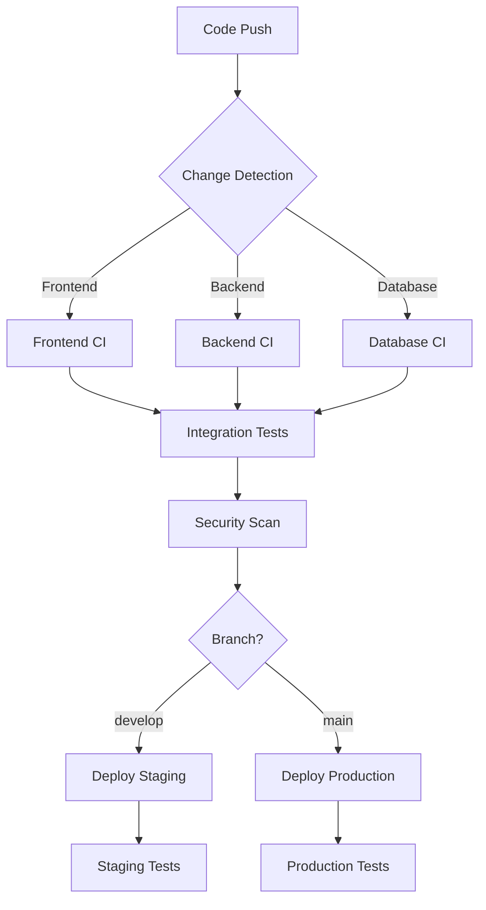

# LINE Commerce Monorepo Template

A production-ready monorepo template for LINE Commerce applications featuring Next.js frontend, FastAPI backend, PostgreSQL database, and comprehensive DevOps setup.

## 🚀 Quick Start

### Prerequisites

- Docker and Docker Compose
- Node.js 18+ (for local frontend development)
- Python 3.12+ (for local backend development)
- Git

### Local Development Setup

1. **Clone and setup the repository:**
   ```bash
   git clone <your-repo-url>
   cd line-commerce-monorepo
   make start
   ```

2. **Start the development environment:**

   **Option 1 - Using Make (recommended):**
   ```bash
   make start              # Start development environment
   make dev-tools          # Start with additional tools (pgAdmin, Redis, Mailhog)
   make help               # See all available commands
   ```

   **Option 2 - Using development script:**
   ```bash
   ./scripts/dev-setup.sh start    # Full development setup with health checks
   ```

   **Option 3 - Using Docker Compose directly:**
   ```bash
   docker-compose up -d            # Basic startup
   ```

3. **Access the applications:**
   - Frontend: http://localhost:3000
   - Backend API: http://localhost:8000
   - API Documentation: http://localhost:8000/docs
   - Database: localhost:5432

4. **Additional development tools** (when using `make dev-tools`):
   - pgAdmin: http://localhost:5050 (admin@linecommerce.com / admin123)
   - Redis: localhost:6379
   - Mailhog: http://localhost:8025

### Development Features

- **Hot Reloading**: Both frontend and backend automatically reload on code changes
- **Database Seeding**: Automatic sample data creation for development
- **Health Checks**: All services include health monitoring
- **Integration Testing**: Comprehensive test suite with isolated test environment
- **Development Tools**: Optional pgAdmin, Redis, and Mailhog for enhanced development

### Environment Configuration

This template uses a comprehensive environment configuration system with validation and security checks.

1. **Copy environment templates:**
   ```bash
   # Root configuration
   cp .env.local.example .env

   # Frontend configuration
   cp frontend/.env.example frontend/.env.local

   # Backend configuration
   cp backend/.env.example backend/.env
   ```

2. **Generate secure secrets:**
   ```bash
   # Generate JWT secret (32+ characters)
   openssl rand -hex 32

   # Generate NextAuth secret
   openssl rand -base64 32
   ```

3. **Validate configuration:**
   ```bash
   # Validate current environment (check .env files manually)
   # Environment validation is now handled by the application startup
   ```

#### Required Variables
- `DATABASE_URL`: PostgreSQL connection string
- `JWT_SECRET_KEY`: Secret key for JWT token generation (32+ chars)
- `NEXTAUTH_SECRET`: Secret for NextAuth.js sessions (32+ chars)
- `NEXT_PUBLIC_API_URL`: Backend API URL
- `NEXT_PUBLIC_APP_URL`: Frontend application URL

#### OAuth Configuration (Optional)
- `GOOGLE_CLIENT_ID`: Google OAuth client ID
- `GOOGLE_CLIENT_SECRET`: Google OAuth client secret
- `APPLE_CLIENT_ID`: Apple OAuth client ID
- `APPLE_CLIENT_SECRET`: Apple OAuth client secret

📖 **For detailed environment configuration, see [Environment Configuration Guide](docs/ENVIRONMENT_CONFIGURATION.md)**
- `NODE_ENV`: Environment (development/production)
- `POSTGRES_DB`: Database name
- `POSTGRES_USER`: Database username
- `POSTGRES_PASSWORD`: Database password

## 📁 Project Structure

```
├── frontend/           # Next.js application
│   ├── app/           # App Router pages
│   ├── components/    # Reusable UI components
│   ├── lib/          # Utility functions and API clients
│   └── middleware.ts # Authentication middleware
├── backend/           # FastAPI application
│   ├── app/          # Application code
│   │   ├── api/      # API routes
│   │   ├── core/     # Core configuration
│   │   ├── models/   # Database models
│   │   ├── schemas/  # Pydantic schemas
│   │   ├── services/ # Business logic
│   │   └── repositories/ # Data access layer
│   └── alembic/      # Database migrations
├── infra/            # Infrastructure as Code
├── scripts/          # Utility scripts
├── .github/workflows/ # CI/CD pipelines
└── docker-compose.yml # Local development orchestration
```

## 🧪 Testing

### Running Tests

**Integration Tests:**
```bash
# Using Make
make test

# Using script
./scripts/run-integration-tests.sh

# Using Docker Compose
docker-compose -f docker-compose.yml -f docker-compose.test.yml up --build --abort-on-container-exit
```

**Backend Tests:**
```bash
# In Docker container
make shell-backend
pytest tests/ -v

# Local development
cd backend
pytest
pytest --cov=app tests/
```

**Frontend Tests:**
```bash
# In Docker container
make shell-frontend
npm test

# Local development
cd frontend
npm test
npm run test:e2e
```

### Database Operations

**Using Make:**
```bash
make seed              # Seed database with sample data
make reset             # Reset database (removes all data)
make migrate           # Run database migrations
make migrate-create message="description"  # Create new migration
make backup-db         # Backup database
make restore-db file=backup.sql  # Restore from backup
```

**Using Scripts:**
```bash
# Database operations
make seed              # Add sample data
make reset             # Reset database (removes all data)
```

## 🚢 Deployment

### Production Infrastructure

This template includes comprehensive Terraform infrastructure for deploying to AWS and Vercel:

- **Frontend**: Next.js deployed to Vercel with custom domain support
- **Backend**: FastAPI on AWS ECS Fargate with auto-scaling
- **Database**: Managed PostgreSQL on AWS RDS with backups
- **Networking**: VPC with public/private subnets and security groups
- **Load Balancing**: Application Load Balancer with SSL termination
- **Secrets**: AWS Secrets Manager for secure credential storage
- **CI/CD**: GitHub Actions with OIDC for secure deployments

### Quick Infrastructure Deployment

1. **Setup Terraform backend:**
   ```bash
   cd infra
   make setup              # Creates S3 bucket and DynamoDB table for state
   ```

2. **Deploy to development:**
   ```bash
   make dev-plan           # Review what will be created
   make dev-apply          # Deploy infrastructure
   make dev-output         # Show deployment URLs and info
   ```

3. **Deploy to production:**
   ```bash
   # Update infra/environments/prod.tfvars with your domain
   make prod-plan
   make prod-apply
   ```

### Infrastructure Management

**Environment Commands:**
```bash
# Development environment
make dev-plan           # Plan development deployment
make dev-apply          # Deploy development environment
make dev-destroy        # Destroy development environment

# Staging environment
make staging-plan       # Plan staging deployment
make staging-apply      # Deploy staging environment

# Production environment
make prod-plan          # Plan production deployment
make prod-apply         # Deploy production environment
```

**Application Deployment:**
```bash
make build-backend ENV=prod     # Build backend Docker image
make push-backend ENV=prod      # Push to ECR
make deploy-backend ENV=prod    # Deploy backend to ECS
make health-check ENV=prod      # Check backend health
```

**Monitoring and Logs:**
```bash
make status ENV=prod            # Show infrastructure status
make logs-backend ENV=prod      # Tail backend logs
make logs-db ENV=prod          # Tail database logs
```

### Environment-Specific Configurations

- **Development** (`infra/environments/dev.tfvars`):
  - Single AZ deployment for cost optimization
  - Smaller instance sizes (db.t3.micro, 256 CPU)
  - ECS Exec enabled for debugging
  - 3-day backup retention

- **Staging** (`infra/environments/staging.tfvars`):
  - Multi-AZ for reliability testing
  - Medium instance sizes (db.t3.small, 512 CPU)
  - Production-like configuration
  - 7-day backup retention

- **Production** (`infra/environments/prod.tfvars`):
  - Multi-AZ with high availability
  - Larger instance sizes (db.t3.medium, 1024 CPU)
  - Enhanced monitoring and performance insights
  - 30-day backup retention
  - Deletion protection enabled

### Custom Domain Setup

1. **Update environment configuration:**
   ```bash
   # Edit infra/environments/prod.tfvars
   domain_name = "your-domain.com"
   ```

2. **Deploy infrastructure:**
   ```bash
   make prod-apply
   ```

3. **Configure DNS:**
   - Add CNAME record for `api.your-domain.com` → ALB DNS name
   - Vercel will automatically handle frontend domain configuration

### CI/CD Pipeline

The infrastructure includes GitHub Actions OIDC setup for secure deployments:

1. **Configure GitHub Secrets:**
   - `AWS_ROLE_ARN`: IAM role ARN for GitHub Actions
   - `VERCEL_TOKEN`: Vercel API token for frontend deployment

2. **Update repository references:**
   - Edit `infra/frontend.tf` and update GitHub repository paths
   - Update OIDC provider trust policy with your repository

3. **Automated deployment** triggers on:
   - Push to `main` branch (production)
   - Push to `develop` branch (staging)
   - Pull requests (development environment)

📖 **For detailed infrastructure documentation, see [Infrastructure Guide](infra/README.md)**

## 🔄 CI/CD Pipeline

This template includes a comprehensive CI/CD pipeline with GitHub Actions that provides automated testing, building, and deployment.

### Pipeline Features

- **🔍 Smart Change Detection**: Runs only relevant jobs based on changed files
- **🧪 Comprehensive Testing**: Frontend, backend, database, and integration tests
- **🔒 Security Scanning**: Dependency scanning, code analysis, and vulnerability detection
- **📊 Performance Monitoring**: Load testing and performance benchmarks
- **🚀 Zero-Downtime Deployment**: Blue-green deployments with health checks
- **🔄 Rollback Capability**: Quick rollback to previous versions

### Workflow Overview



### Automatic Deployments

- **Staging**: Triggered on push to `develop` branch
- **Production**: Triggered on push to `main` branch
- **Manual**: Can be triggered via GitHub Actions UI

### Required GitHub Secrets

Configure these secrets in your repository settings:

```bash
# AWS Configuration
AWS_ACCESS_KEY_ID          # AWS access key for deployment
AWS_SECRET_ACCESS_KEY      # AWS secret key for deployment

# Database URLs
PROD_DATABASE_URL          # Production PostgreSQL connection
STAGING_DATABASE_URL       # Staging PostgreSQL connection

# Vercel Configuration
VERCEL_TOKEN              # Vercel API token
VERCEL_ORG_ID            # Vercel organization ID
VERCEL_PROJECT_ID        # Vercel project ID

# Application URLs
FRONTEND_URL             # Production frontend URL
BACKEND_API_URL          # Production backend API URL
```

### CI/CD Commands

```bash
# View workflow status
gh workflow list

# Trigger manual deployment
gh workflow run deploy-production.yml

# Trigger rollback (emergency)
gh workflow run rollback.yml -f environment=prod -f rollback_type=backend-only

# View deployment logs
gh run list --workflow=deploy-production.yml
gh run view <run-id>
```

### Monitoring Deployments

- **GitHub Actions**: View workflow runs and logs
- **AWS CloudWatch**: Monitor ECS services and application logs
- **Vercel Dashboard**: Monitor frontend deployments and performance
- **Health Checks**: Automated endpoint validation after deployment

📖 **For detailed CI/CD documentation, see [CI/CD Guide](.github/README.md)**

## 🔧 Development Commands

### Make Commands (Recommended)
```bash
make help              # Show all available commands
make start             # Start development environment
make stop              # Stop all services
make restart           # Restart all services
make status            # Show service status and URLs
make logs              # Show logs (add service=name for specific service)
make test              # Run integration tests
make clean             # Clean up Docker resources
make dev-tools         # Start with additional development tools

# Database operations
make seed              # Seed database with sample data
make reset             # Reset database
make migrate           # Run migrations
make backup-db         # Backup database

# Development utilities
make shell-backend     # Open shell in backend container
make shell-frontend    # Open shell in frontend container
make shell-db          # Open PostgreSQL shell
make lint              # Run linting
make format            # Format code
```

### Docker Compose Commands
```bash
# Basic operations
docker-compose up -d                    # Start services
docker-compose down                     # Stop services
docker-compose logs -f [service]        # View logs
docker-compose restart [service]        # Restart service

# Development with additional tools
docker-compose -f docker-compose.yml -f docker-compose.dev.yml up -d

# Testing environment
docker-compose -f docker-compose.yml -f docker-compose.test.yml up --build
```

### Database Management
```bash
# Using Docker containers
docker-compose exec backend alembic upgrade head
docker-compose exec backend alembic revision --autogenerate -m "Description"
docker-compose exec postgres psql -U postgres -d line_commerce

# Reset database (development only)
docker-compose down -v
docker-compose up -d postgres
```

### Code Quality
```bash
# Using Make
make lint              # Run linting for both frontend and backend
make format            # Format code for both frontend and backend

# Manual commands
# Frontend linting
cd frontend
npm run lint
npm run lint:fix

# Backend linting
cd backend
black .
isort .
flake8 .
```

## 🏗️ Architecture

### Technology Stack
- **Frontend**: Next.js 15, TypeScript, Tailwind CSS
- **Backend**: Python 3.12+, FastAPI, SQLAlchemy
- **Database**: PostgreSQL 16
- **Authentication**: JWT with HTTP-only cookies, OAuth (Google/Apple)
- **Infrastructure**: Docker, Terraform
- **CI/CD**: GitHub Actions

### Key Features
- Server-side rendering with Next.js App Router
- Type-safe API with FastAPI and Pydantic
- ACID-compliant PostgreSQL database
- JWT-based authentication with OAuth support
- Containerized development and deployment
- Infrastructure as Code with Terraform
- Automated CI/CD with GitHub Actions

## 🔐 Security

- Environment variables for sensitive configuration
- JWT tokens stored in HTTP-only cookies
- OAuth integration for secure authentication
- Database connection pooling and prepared statements
- CORS configuration for API security
- Automated security scanning in CI/CD

## 📚 Extension Points

The template includes stub models for future development:
- **Users**: Authentication and profile management
- **Items**: Basic CRUD operations
- **Merchants**: Multi-tenant commerce support (stub model included)
- **Products**: Product catalog management (stub model included)
- **Orders**: Order processing and fulfillment (stub model included)

### Stub Models

The template includes extensible stub models in `backend/app/models/`:

- **Merchant Model** (`merchant.py`): Foundation for vendor/seller management
  - Basic merchant information (name, description, contact)
  - Active status tracking
  - Extension points for payment processing, commission rates, etc.

- **Product Model** (`product.py`): Foundation for product catalog
  - Product information (name, description, price, SKU)
  - Merchant relationship
  - Stock quantity tracking
  - Extension points for categories, variants, images, etc.

- **Order Model** (`order.py`): Foundation for order management
  - Order lifecycle tracking with status enum
  - User relationship
  - Total amount and currency support
  - Extension points for order items, shipping, payments, etc.

These models provide a starting point for e-commerce functionality while maintaining flexibility for specific business requirements.

### Architecture Validation

The template includes validation tools to maintain architectural integrity:

```bash
# Validate layer separation (ensures proper dependency flow)
python backend/validate_layer_separation.py

# Validate implementation completeness
python backend/validate_implementation.py

# Environment validation is handled by application startup
# Check .env files manually or use application health checks
```

📖 **For detailed architecture documentation, see [Architecture Guide](docs/ARCHITECTURE.md)**

## 🤝 Contributing

1. Fork the repository
2. Create a feature branch
3. Make your changes
4. Add tests for new functionality
5. Ensure all tests pass
6. Submit a pull request

## 📄 License

This project is licensed under the MIT License - see the LICENSE file for details.

## 🆘 Support

For questions and support:
1. Check the documentation in each service directory
2. Review the GitHub Issues for common problems
3. Create a new issue with detailed information

---

**Note**: This is a template repository. Customize the configuration, branding, and features according to your specific LINE Commerce requirements.
